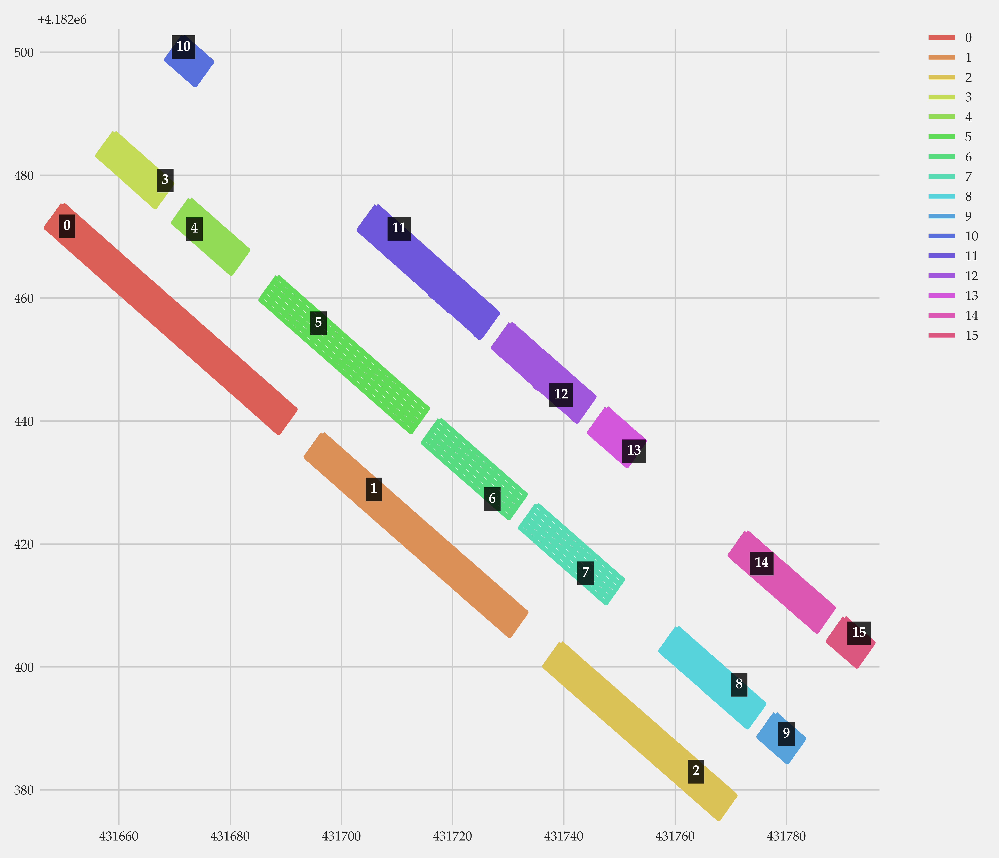
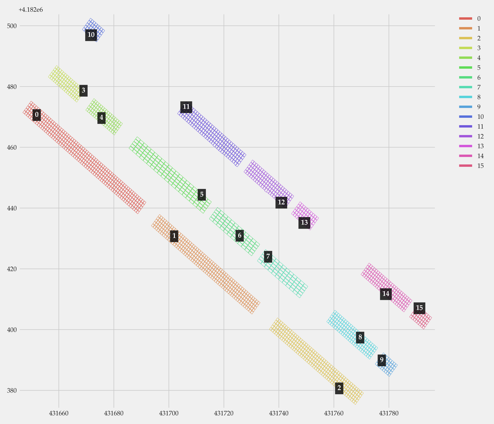

# Naming of solar panels

 

Naming of solar panels according to their spatial distribution and clustering in panels. This repository requires a previous tool for automatically extracting quads depicting solar panels. Hence, the input of this program is a `.shp` file.

## Dependencies

Dependencies are defined in `requirements.txt`. These include `matplotlib`, `numpy`, `seaborn`, `Fiona`, `pandas` and `jupyter`.

## Processing

The workflow mainly depends on three parameters that can be found in `panel_naming.ipynb`, which are the following:

1. **Filename**: path of a `.shp` file that includes the geometry of solar panels. 

2. **Epsilon distance** in DBSCAN: maximum distance between two points.

3. **Max distance between cells in the same row**. It must be configured according to how well were cells obtained. Normally, a value below 0.5 meters works fine.

The workflow consists of two main steps:

1. **Clustering and ordering of arrays**. Arrays are the nomenclature used to refer to isolated groups of solar panels. These are first extracted with DBSCAN and then sorted in X and Y.

     
    <em>Ordered identification of arrays.</em>

2. **Clustering and ordering of cells**. The same as the previous step, but applied to panels in arrays instead of simply arrays.

     
    <em>Ordered identification of arrays and panels.</em>

## TODO

- Automatically detect gaps and include new quads representing missing solar panels.
- Make it robust to manage arrays that have different directions. Currently, a global direction is averaged and every array is considered to expand in such a direction.
